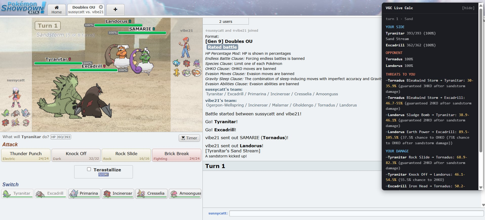

<div align="center">

# Pokémon Damage Calculator

**A faster way to run damage numbers for Gen 9 OU and Pokémon Champions.**

If you've used the Pokémon Showdown calculator, you know the grind: every time
you want to check a matchup you re-type the opponent's spread, ability, item, and
moves by hand, guessing the set you're up against. I got tired of that. So this
calculator does the busywork for you. Paste your team once, drag a Pokémon into a
slot, and the other side fills itself in with the set people *actually* run. Less
data entry, more time spent reading the rolls that matter, all on the same
engine that powers the official Showdown calculator.

### [▶ Live demo](https://huydamm.github.io/PokemonVGC-Calculator/)

[](https://www.typescriptlang.org/)
[](https://react.dev/)
[](https://vite.dev/)
[](https://vitest.dev/)
[](https://github.com/smogon/damage-calc)


</div>

---

## Table of Contents

- [Features](#features)
- [Quick Start](#quick-start)
- [Usage](#usage)
- [Tech Stack](#tech-stack)
- [Architecture](#architecture)
- [Live Battle Overlay](#live-battle-overlay-chrome-extension)
- [Mega Evolution](#mega-evolution)
- [Testing](#testing)
- [Known Limitations](#known-limitations)
- [License](#license)

## Features

Everything you already expect from a damage calculator (every move's roll range
and % of HP, KO chances, weather and terrain, screens, stat stages, status,
crits, Tera and Mega), **plus** the parts Showdown makes you do by hand:

- **Auto-fills the opponent.** Search any Pokémon and it loads the set people
  actually run (spread, ability, item, Tera, moves) from real usage stats, and
  every choice is still swappable from a dropdown labelled with its usage %.
- **Paste your team, drag to calc.** Paste a Showdown export once and drag your
  Pokémon into the attacker/defender slots instead of retyping them.
- **One-click Tera and Mega.** Terastallize either side with a toggle, or switch
  Mega formes from a dropdown in Champions.
- **Edit any spread by hand.** Adjust EVs and nature directly for quick what-ifs.
  Champions uses its Stat Point system (0 to 32 per stat, 66 total) instead of EVs.
- **Bulk heatmap.** For the featured move, a colour-coded grid shows how much HP
  and defensive investment the defender needs to survive the hit.
- **Pick your format.** Gen 9 OU, Pokémon Champions, or VGC 2026. Game type,
  level, and legal Megas adjust automatically.

> **Example:** paste your team, drag in **Incineroar** as the attacker, then type
> *"Garchomp"* for the defender. It instantly loads Garchomp's most-used
> spread/item/moves and shows what each of Incineroar's moves does to it.

## Quick Start

> Requires Node.js 18+.

```bash
npm install      # install dependencies
npm run dev      # start the dev server at http://localhost:5173
```

### Other scripts

| Script | Description |
| --- | --- |
| `npm run dev` | Start the Vite dev server with HMR. |
| `npm run build` | Type-check and produce a minified, tree-shaken production build. |
| `npm run preview` | Serve the production build locally. |
| `npm test` | Run the unit / integration suite (Vitest). |
| `npm run prove` | Verify the engine wiring against the bundled Showdown engine. |
| `npm run smoke` | Drive the full UI in headless Chrome and assert zero console errors (dev server must be running). |

## Usage

1. Pick a **version** in the top-right selector (Gen 9 OU, Pokémon Champions, or
   VGC 2026).
2. Paste a Showdown team export into the textarea, or click **load sample team**.
3. Assign the **Attacker** and **Defender**: drag a roster card into a slot (or
   use the ⚔ / 🛡 buttons), and **search a Pokémon** in the other slot to
   auto-fill its common competitive set.
4. Adjust **battle conditions** and per-Pokémon stat stages / status as needed.
5. Read the **results**: click any move to feature it and see its full damage
   roll, % of HP, KO chance, and the Showdown description.

## Tech Stack

**Vite + React + TypeScript.** Vite provides fast HMR and a Rollup production
build that minifies (esbuild) and tree-shakes `@smogon/calc`, whose data tables
are large. The app imports the engine's `@smogon/calc/dist/adaptable` entry so it
reads data from a single shared `@pkmn/dex` generation rather than the engine's
bundled tables, so dex data is never shipped twice. React suits the drag-driven,
many-small-panels UI; `@dnd-kit` provides drag-and-drop with a keyboard fallback.

| Concern | Library | Location |
| --- | --- | --- |
| Damage engine | [`@smogon/calc`](https://github.com/smogon/damage-calc) (adaptable entry) | `src/services/calc.ts` |
| Dex / forme data (single source) | [`@pkmn/dex`](https://github.com/pkmn/ps) + `@pkmn/data` | `src/services/data.ts` |
| Team-paste parsing | [`@pkmn/sets`](https://github.com/pkmn/ps) | `src/services/team.ts` |
| Opponent sets + usage stats | [`@pkmn/smogon`](https://github.com/pkmn/smogon) | `src/services/sets.ts` |
| Pokémon sprites + item icons | [`@pkmn/img`](https://github.com/pkmn/img) | `src/services/sprites.ts` |
| Format discovery (data.pkmn.cc) | native `fetch` | `src/services/formats.ts` |

## Architecture

A thin, UI-independent **service layer** wraps the engine, data, parsing, and
network access; React components consume it. Each service is testable on its own.

```
src/
├── services/
│   ├── data.ts         # the single shared Gen 9 Generation (with Megas re-admitted)
│   ├── calc.ts         # @smogon/calc/adaptable wrapper: Pokémon/Move/Field + runCalc
│   ├── team.ts         # Showdown paste parsing, species search, forme helpers
│   ├── sets.ts         # opponent common-set builder + usage-stat fallback chain
│   ├── formats.ts      # runtime format/data discovery from data.pkmn.cc
│   └── conditions.ts   # battle-conditions + per-Pokémon modifier model
├── components/         # RosterCard, OpponentPicker, OpponentEditor,
│                       #   ConditionsPanel, Results
└── App.tsx             # orchestration & state
```

## Live Battle Overlay (Chrome extension)

The `extension/` folder is a Chrome (Manifest V3) extension that brings the same
engine to **live Pokémon Showdown games**. It reads your active battle, shows
damage both ways in an overlay, and adds an assistant you can ask questions.

<div align="center">

</div>

- **Reads the live board.** Both active Pokémon, HP, boosts, weather, terrain,
  side conditions, plus your full team's exact stats (from the battle's request
  data) and the opponent's previewed species, updating every turn.
- **Both-direction calcs.** For the active matchup it shows what the opponent
  threatens against you and what you do back, with KO chances. The opponent's
  hidden set is inferred from usage stats and tightens as the battle reveals
  item, ability, moves, and Tera. Inferred numbers are marked with a `~`.
- **Ask the agent, by voice or text.** A question box (and a mic button) runs a
  Claude (Haiku 4.5) assistant that answers in a sentence or two, grounded in the
  real numbers. Speak a question and it talks the answer back; type one and it
  replies in text. It never does the math itself: for any matchup not already on
  screen (a bench Pokémon, a Tera, a stat boost, a switch-in) it calls a
  `run_calc` tool backed by the actual engine. Voice uses the browser's built-in
  Web Speech APIs.

The extension reuses the app's `src/services/` calc, data, and set-inference
layer, so it stays in sync with the calculator.

```bash
npm run build:ext     # bundle the extension into extension/dist
```

Load it from `chrome://extensions` (enable Developer mode, then **Load unpacked**
and pick the `extension/` folder). For the assistant, open the extension's options
and paste an Anthropic API key; it is stored locally and only sent to
api.anthropic.com.

## Mega Evolution

Megas are an alternate forme: selecting one feeds the Mega species to the calc,
which applies post-Mega stats and force-overwrites the ability automatically.
`@pkmn/data`'s Gen 9 layer hides Megas (they don't exist in Scarlet/Violet), so
`data.ts` re-admits Mega/Primal formes for Champions, and availability is
detected from the data layer at runtime, so the calculator lights up new Megas
as the data source adds them.

Verified against live data:

- The newer Champions Megas **are** present and calculable, e.g. Pyroar-Mega
  (Fire Mane), Glimmora, Baxcalibur, Floette, Dragalge, Eelektross, Scovillain.
- **Tatsugiri-Mega** and **Annihilape-Mega** are not yet in the data, so the UI
  doesn't offer them and resolution degrades to the base forme.
- The classic Megas absent from Champions' legal pool (Sceptile, Blaziken,
  Swampert, Mawile, Salamence, Metagross) still resolve in the data layer.

## Testing

```bash
npm test
```

The suite covers the opponent set-suggestion **fallback chain** (mocked fetch
reaches each tier and never throws on missing data), **Mega forme resolution**
(present formes apply post-Mega stats/ability; absent formes degrade safely),
**known damage calcs** verified against the bundled Showdown engine (including a
Charizard-Mega-Y example), **team-paste parsing** of a realistic export with a
Mega, and **battle-conditions → Field** wiring. `npm run smoke` additionally
drives the real UI in headless Chrome and fails on any console error.

## Known Limitations

- **Champions usage data isn't published on data.pkmn.cc yet**, so opponent
  auto-fill for Champions falls back to the newest VGC usage (`gen9vgc2026`
  stats / `gen9vgc2025` sets) with a surfaced note. Gen 9 OU has full live data.
- **Champions Stat Points** run on the standard EV-based engine by mapping 1 SP
  to 8 EVs, which is exact at Level 50 (where 8 EVs add 1 stat point). The one
  edge case is a maxed 32-SP stat, which lands 1 point low because the engine
  caps EVs at 252.

## License

Released under the [MIT License](LICENSE).

---

<div align="center">
<sub>Damage mechanics by <a href="https://github.com/smogon/damage-calc">@smogon/calc</a> · dex data by <a href="https://github.com/pkmn/ps">@pkmn</a> · sprites & usage stats from Pokémon Showdown / data.pkmn.cc. Not affiliated with Nintendo, Game Freak, or The Pokémon Company.</sub>
</div>
