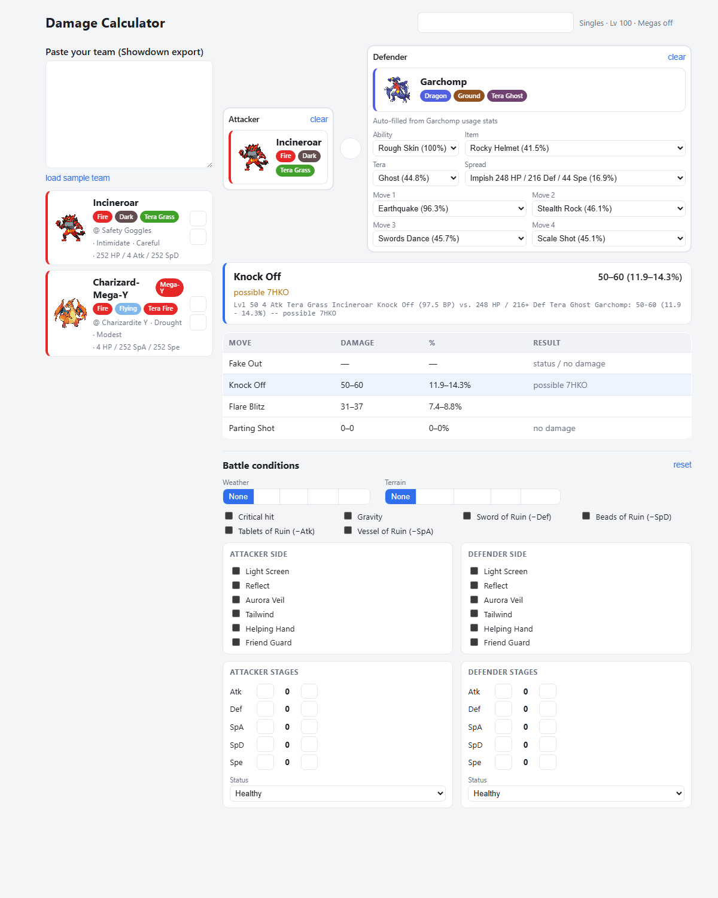

<div align="center">

# Pokémon Damage Calculator

**A fast, paste-driven damage calculator for Gen 9 OU and Pokémon Champions.**

Paste your team, drag a Pokémon into a slot, and the other side auto-fills with
the most common competitive set — powered by the same engine behind the official
Pokémon Showdown calculator.

[](https://www.typescriptlang.org/)
[](https://react.dev/)
[](https://vite.dev/)
[](https://vitest.dev/)
[](https://github.com/smogon/damage-calc)



</div>

---

## Table of Contents

- [Features](#features)
- [Quick Start](#quick-start)
- [Usage](#usage)
- [Tech Stack](#tech-stack)
- [Architecture](#architecture)
- [Mega Evolution](#mega-evolution)
- [Testing](#testing)
- [Known Limitations](#known-limitations)

## Features

- **📋 Paste → roster cards.** Paste a standard Showdown team export and get
  cards with sprite, forme, types, item, ability, nature, and EV spread.
  Malformed input produces inline errors — it never crashes.
- **🎯 Drag-to-assign.** Drag any team Pokémon into the **Attacker** or
  **Defender** slot (`@dnd-kit`), with ⚔ / 🛡 click-to-assign for mobile and
  accessibility, re-drag-to-swap, and a one-click ⇄ swap.
- **🔎 Opponent search + auto common-set.** Fuzzy-search any Pokémon; on select,
  its most common ability, item, Tera type, spread, and moves load from usage
  statistics, each swappable via **usage-% dropdowns**.
- **🗂️ Version selector.** Switch between **Gen 9 OU** (Singles, Lv 100),
  **Pokémon Champions** (Doubles, Lv 50, Megas) and **VGC 2026**. Data sources
  are discovered from data.pkmn.cc at runtime, with a graceful fallback chain.
- **🔱 Mega Evolution.** A per-slot forme dropdown (Champions) that applies
  post-Mega stats and force-overwrites the ability, plus a non-blocking
  one-Mega-per-team warning.
- **🌦️ Battle conditions.** Weather, terrain, gravity, the four Ruin abilities,
  per-side screens / Tailwind / Helping Hand / Friend Guard, per-Pokémon stat
  stages (−6…+6) and status, and a critical-hit toggle — all wired into the calc.
- **📊 Results.** A featured move with its roll range, % of defender HP, the
  Showdown description string, and the KO summary (guaranteed vs. probability),
  alongside an at-a-glance table of every move.

## Quick Start

> Requires Node.js 18+.

```bash
npm install      # install dependencies
npm run dev      # start the dev server at http://localhost:5173
```

### Other scripts

| Script | Description |
| --- | --- |
| `npm run dev` | Start the Vite dev server with HMR. |
| `npm run build` | Type-check and produce a minified, tree-shaken production build. |
| `npm run preview` | Serve the production build locally. |
| `npm test` | Run the unit / integration suite (Vitest). |
| `npm run prove` | Verify the engine wiring against the bundled Showdown engine. |
| `npm run smoke` | Drive the full UI in headless Chrome and assert zero console errors (dev server must be running). |

## Usage

1. Pick a **version** in the top-right selector (Gen 9 OU, Pokémon Champions, or
   VGC 2026).
2. Paste a Showdown team export into the textarea — or click **load sample team**.
3. Assign the **Attacker** and **Defender**: drag a roster card into a slot (or
   use the ⚔ / 🛡 buttons), and **search a Pokémon** in the other slot to
   auto-fill its common competitive set.
4. Adjust **battle conditions** and per-Pokémon stat stages / status as needed.
5. Read the **results**: click any move to feature it and see its full damage
   roll, % of HP, KO chance, and the Showdown description.

## Tech Stack

**Vite + React + TypeScript.** Vite provides fast HMR and a Rollup production
build that minifies (esbuild) and tree-shakes `@smogon/calc`, whose data tables
are large. The app imports the engine's `@smogon/calc/dist/adaptable` entry so it
reads data from a single shared `@pkmn/dex` generation rather than the engine's
bundled tables — dex data is never shipped twice. React suits the drag-driven,
many-small-panels UI; `@dnd-kit` provides drag-and-drop with a keyboard fallback.

| Concern | Library | Location |
| --- | --- | --- |
| Damage engine | [`@smogon/calc`](https://github.com/smogon/damage-calc) (adaptable entry) | `src/services/calc.ts` |
| Dex / forme data (single source) | [`@pkmn/dex`](https://github.com/pkmn/ps) + `@pkmn/data` | `src/services/data.ts` |
| Team-paste parsing | [`@pkmn/sets`](https://github.com/pkmn/ps) | `src/services/team.ts` |
| Opponent sets + usage stats | [`@pkmn/smogon`](https://github.com/pkmn/smogon) | `src/services/sets.ts` |
| Format discovery (data.pkmn.cc) | native `fetch` | `src/services/formats.ts` |

## Architecture

A thin, UI-independent **service layer** wraps the engine, data, parsing, and
network access; React components consume it. Each service is testable on its own.

```
src/
├── services/
│   ├── data.ts         # the single shared Gen 9 Generation (with Megas re-admitted)
│   ├── calc.ts         # @smogon/calc/adaptable wrapper: Pokémon/Move/Field + runCalc
│   ├── team.ts         # Showdown paste parsing, species search, forme helpers
│   ├── sets.ts         # opponent common-set builder + usage-stat fallback chain
│   ├── formats.ts      # runtime format/data discovery from data.pkmn.cc
│   └── conditions.ts   # battle-conditions + per-Pokémon modifier model
├── components/         # RosterCard, OpponentPicker, OpponentEditor,
│                       #   ConditionsPanel, Results
└── App.tsx             # orchestration & state
```

## Mega Evolution

Megas are an alternate forme: selecting one feeds the Mega species to the calc,
which applies post-Mega stats and force-overwrites the ability automatically.
`@pkmn/data`'s Gen 9 layer hides Megas (they don't exist in Scarlet/Violet), so
`data.ts` re-admits Mega/Primal formes for Champions, and availability is
detected from the data layer at runtime — so the calculator lights up new Megas
as the data source adds them.

Verified against live data:

- The newer Champions Megas **are** present and calculable — e.g. Pyroar-Mega
  (Fire Mane), Glimmora, Baxcalibur, Floette, Dragalge, Eelektross, Scovillain.
- **Tatsugiri-Mega** and **Annihilape-Mega** are not yet in the data, so the UI
  doesn't offer them and resolution degrades to the base forme.
- The classic Megas absent from Champions' legal pool (Sceptile, Blaziken,
  Swampert, Mawile, Salamence, Metagross) still resolve in the data layer.

## Testing

```bash
npm test
```

The suite covers the opponent set-suggestion **fallback chain** (mocked fetch
reaches each tier and never throws on missing data), **Mega forme resolution**
(present formes apply post-Mega stats/ability; absent formes degrade safely),
**known damage calcs** verified against the bundled Showdown engine (including a
Charizard-Mega-Y example), **team-paste parsing** of a realistic export with a
Mega, and **battle-conditions → Field** wiring. `npm run smoke` additionally
drives the real UI in headless Chrome and fails on any console error.

## Known Limitations

- **Champions usage data isn't published on data.pkmn.cc yet**, so opponent
  auto-fill for Champions falls back to the newest VGC usage (`gen9vgc2026`
  stats / `gen9vgc2025` sets) with a surfaced note. Gen 9 OU has full live data.
- **Item icons** are rendered as text chips rather than images: `@pkmn/dex` items
  carry no `spritenum` and Showdown's individual item PNGs are inconsistent, so
  faithful icons would require an additional sprite dependency. Pokémon sprites
  are full images.

---

<div align="center">
<sub>Damage mechanics by <a href="https://github.com/smogon/damage-calc">@smogon/calc</a> · dex data by <a href="https://github.com/pkmn/ps">@pkmn</a> · sprites & usage stats from Pokémon Showdown / data.pkmn.cc. Not affiliated with Nintendo, Game Freak, or The Pokémon Company.</sub>
</div>
